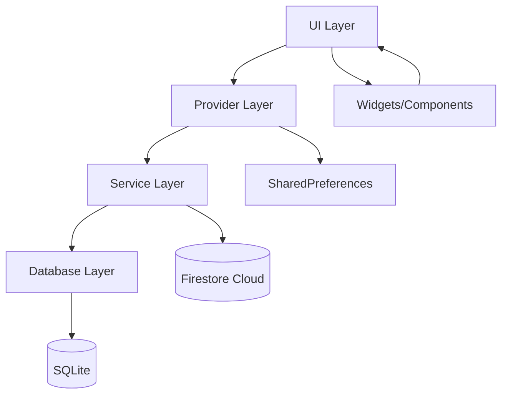

<p align="center">
  
  
  
  
</p>

<p align="center">
  
  
  
  
</p>

<br>

<div align="center">
  
#  BlueMart Retail

### Aplikasi E-Commerce Gadget & Elektronik Modern

**Dibangun dengan Flutter & Arsitektur Provider Pattern**

</div>

<br>

<p align="center">
  <b>🏆 Project Akhir Pemrograman Piranti Bergerak — Kelompok 04</b><br>
  <sub>Teknologi Informasi — Semester IV | TI253311</sub>
</p>

<br>

---

<div align="center">
  
[🎯 Fitur Utama](#-fitur-utama) • [📸 Tampilan Aplikasi](#-tampilan-aplikasi) • [🏗️ Arsitektur](#%EF%B8%8F-arsitektur) • [📦 Instalasi](#-instalasi) • [👥 Akun Demo](#-akun-demo) • [🛠️ Teknologi](#%EF%B8%8F-teknologi)

</div>

---

<br>

##  Overview

**BlueMart Retail** adalah aplikasi mobile e-commerce modern untuk belanja gadget dan elektronik. Aplikasi ini memiliki **dua role pengguna** — **User** dan **Admin** — dengan fitur lengkap mulai dari browsing produk hingga manajemen toko. Dibangun menggunakan Flutter dengan arsitektur Provider pattern dan database SQLite lokal.

> <span style="color: #3B82F6;">🎯</span> **Visi**: Memberikan pengalaman belanja gadget yang mulus, modern, dan menyenangkan bagi pengguna, serta alat manajemen yang powerfull bagi admin.

<br>

<div align="center">

| Role | Kemampuan Utama |
|:----:|:----------------|
| <span style="color: #3B82F6;">👤 **User**</span> | Browsing produk, keranjang, checkout, riwayat pesanan, favorit, barcode scanner |
| <span style="color: #1E3A8A;">⚙️ **Admin**</span> | Manajemen produk/kategori, kelola pesanan, statistik penjualan, laporan, promo, voucher |

</div>

<br>

---

##  Fitur Utama

### 🔐 Authentication Module
> **Login** dengan username/password • **Role-based access** • Validasi form real-time • Session persist dengan SharedPreferences

```text
┌─────────────────────────────────────┐
│    💙 BlueMart                      │
│    "Masuk ke BlueMart"              │
├─────────────────────────────────────┤
│  ┌─────────────────────────────┐    │
│  │ ✉️ Username                 │    │
│  └─────────────────────────────┘    │
│  ┌─────────────────────────────┐    │
│  │ 🔒 Password                 │    │
│  └─────────────────────────────┘    │
│  ┌─────────────────────────────┐    │
│  │      ┌─────────────────┐    │    │
│  │      │   🔵 Masuk      │    │    │
│  │      └─────────────────┘    │    │
│  └─────────────────────────────┘    │
│  "Belum punya akun? Daftar"         │
└─────────────────────────────────────┘
```

---

### 🛍️ Product & Shopping Module

| Fitur | Deskripsi |
|:------|:----------|
| **🏠 Home Screen** | Auto-scrolling banner, search bar, kategori horizontal, grid produk, shake-to-refresh |
| **📄 Product Detail** | Image gallery, harga asli & diskon, stok & berat, Add to Cart, Favorite toggle |
| **🔍 Search & Filter** | Filter kategori, search, sort options |
| **❤️ Favorite** | Daftar wishlist, remove from favorite |

<p align="center">

</p>

```text
┌──────────────────────────────────────────┐
│  🔍 Cari laptop...              [🛒=3]  │
├──────────────────────────────────────────┤
│  ┌──────────────────────────────────┐    │
│  │  🔥 PROMO HARI INI              │    │
│  │  Diskon Spesial Akhir Pekan     │    │
│  │  🏷️ Dapatkan penawaran terbaik  │    │
│  └──────────────────────────────────┘    │
│  ● ○ ○                                   │
├──────────────────────────────────────────┤
│  Kategori Pilihan                        │
│  [💻] [📱] [🎧] [🕹️] [🔌] [💾]        │
├──────────────────────────────────────────┤
│  Produk Terbaru 🔥                       │
│  ┌──────────┐  ┌──────────┐             │
│  │ 📸       │  │ 📸       │             │
│  │ Laptop A │  │ Laptop B │             │
│  │ Rp 7,9jt │  │ Rp 12jt  │             │
│  │ [❤][🛒]  │  │ [❤][🛒]  │             │
│  └──────────┘  └──────────┘             │
└──────────────────────────────────────────┘
```

---

### 🛒 Cart Module

<details>
<summary><b>📋 Fitur Keranjang Lengkap</b></summary>

| Fitur | Detail |
|:------|:-------|
| ➕ Tambah/Remove | Manajemen item keranjang |
| 🔢 Quantity | Increment/decrement dengan stepper |
| 📊 Order Summary | Subtotal, shipping, tax, grand total |
| 🗑️ Swipe to Delete | Dengan konfirmasi dialog |
| 🚀 Checkout | Tombol dengan total harga |
| 💰 Format | Rp XX.XXX (IDR) |

</details>

```text
┌──────────────────────────────────────────┐
│  🛒 Keranjang Belanja                    │
├──────────────────────────────────────────┤
│  ┌──────────────────────────────────┐    │
│  │ 📸 ASUS VivoBook                 │    │
│  │    [-]  2  [+]  Rp 7.999.000    │    │
│  │    [🗑️ Hapus]                    │    │
│  └──────────────────────────────────┘    │
│  ┌──────────────────────────────────┐    │
│  │ Order Summary                   │    │
│  │ Subtotal:    Rp 15.998.000      │    │
│  │ Shipping:    Rp 50.000          │    │
│  │ Tax (10%):   Rp 1.604.800       │    │
│  │ ────────────────────────────    │    │
│  │ Grand Total: Rp 17.652.800      │    │
│  └──────────────────────────────────┘    │
├──────────────────────────────────────────┤
│  [💙 Checkout Sekarang • Rp 17.652.800] │
└──────────────────────────────────────────┘
```

---

### 💳 Checkout & Payment Module

<div align="center">
  
| 🏷️ Fitur | 🚚 Shipping | 💰 Pembayaran |
|:---------:|:-----------:|:-------------:|
| Alamat pengiriman | JNE, J&T, GoSend | QRIS, Transfer, E-Wallet, COD |
| Promo/Voucher | Estimasi waktu | Virtual Account |
| Order processing | Biaya dinamis | QR Code display |

</div>

```text
┌──────────────────────────────────────────┐
│  💳 Konfirmasi Pesanan                   │
├──────────────────────────────────────────┤
│  📍 Alamat → Rumah, Denpasar    [Ubah]  │
│  🚚 JNE YES • Rp 50.000 • 2-3 Hari      │
│  💰 QRIS | BCA Transfer | COD           │
│  🎟️ Promo: "HEMAT50"  -Rp 100.000      │
│  ┌──────────────────────────────────┐    │
│  │ Subtotal:    Rp 15.000.000      │    │
│  │ Diskon:     -Rp 100.000         │    │
│  │ Grand Total: Rp 16.600.000      │    │
│  └──────────────────────────────────┘    │
└──────────────────────────────────────────┘
```

---

### 📋 Order History Module

| Status | Badge |
|:-------|:-----:|
| 🟡 Menunggu Pembayaran | `Pending` |
| 🔵 Diproses | `Processing` |
| 🟠 Dikirim | `Shipped` |
| 🟢 Selesai | `Completed` |
| 🔴 Dibatalkan | `Cancelled` |

> **Fitur**: Filter status, pull-to-refresh, date grouping, timeline tracking, re-order button

---

### 👤 Profile & User Dashboard

```text
┌──────────────────────────────────────────┐
│  🎴 VIP Membership Card                  │
│  ┌──────────────────────────────────┐    │
│  │  👤 Username                     │    │
│  │  ROLE: USER                      │    │
│  │  ⭐ PENGGUNA BIASA               │    │
│  └──────────────────────────────────┘    │
│                                          │
│  [📊 Pesanan] [🛒 Keranjang] [🎫 Kupon] │
│    12 Aktif      3 Item       3 Tersedia │
│                                          │
│  📋 Riwayat Pesanan                      │
│  📍 Buku Alamat                          │
│  💳 Metode Pembayaran QRIS               │
│  ❓ Pusat Bantuan & FAQ                  │
│  ⚙️ Admin Panel (khusus admin)          │
│                                          │
│  [🔴 Logout]                             │
└──────────────────────────────────────────┘
```

---

### 🔔 Notification Module

| Fitur | User | Admin |
|:------|:----:|:-----:|
| List Notifikasi | ✅ | ✅ |
| Unread Count Badge | ✅ | ✅ |
| Mark as Read | ✅ | ✅ |
| Tab Filter (Semua/Pesanan/Promo) | ✅ | ✅ |
| Broadcast ke Semua User | ❌ | ✅ |

```text
┌──────────────────────────────────────────┐
│  🔔 Notifikasi            [✓ Baca Semua] │
├──────────────────────────────────────────┤
│  [Semua]  [Pesanan]  [Promo]             │
│                                          │
│  📋 Hari Ini                             │
│  ┌──────────────────────────────────┐    │
│  │ 📦 Pesanan #123 Dikirim    [●]   │    │
│  │ 5 menit yang lalu                │    │
│  ├──────────────────────────────────┤    │
│  │ 🏷️ Promo Diskon 50%      [●]   │    │
│  │ 1 jam yang lalu                  │    │
│  └──────────────────────────────────┘    │
│  📅 Kemarin                              │
│  ┌──────────────────────────────────┐    │
│  │ ✅ Pesanan Selesai              │    │
│  │ Terima kasih sudah berbelanja    │    │
│  └──────────────────────────────────┘    │
└──────────────────────────────────────────┘
```

---

### 📱 Sensor Module — Barcode Scanner

| Fitur | Keterangan |
|:------|:-----------|
| 📸 Real-time Camera | Scanning barcode/QR langsung |
| 🔦 Torch | Flashlight on/off toggle |
| 🔄 Camera Switch | Front/back camera |
| 📦 Product Lookup | Cari produk dari database lokal |
| 🎯 Detection | `DetectionSpeed.noDuplicates` |

```text
┌──────────────────────────────────────────┐
│  📸 Scan Barcode / QR                    │
│  [🔦 Flash] [🔄 Flip]                    │
├──────────────────────────────────────────┤
│          ┌──────────────────┐            │
│         ╱                    ╲           │
│        │   ┌────────────┐    │          │
│        │   │ 📷 SCAN    │    │          │
│        │   │   AREA     │    │          │
│        │   └────────────┘    │          │
│         ╲                    ╱           │
│          └──────────────────┘            │
│                                          │
│  "Arahkan kamera ke barcode produk"      │
└──────────────────────────────────────────┘
```

---

### ⚙️ Admin Panel Module

<div align="center">
  
| Dashboard | Products | Orders | Analytics |
|:---------:|:--------:|:------:|:---------:|
| 📊 Statistik | ✏️ CRUD | 📦 Kelola | 📈 Chart |
| Ringkasan | Form + Image | Update Status | Revenue |
| Quick Menu | Kategori | Cancel | Laporan |

</div>

```text
┌──────────────────────────────────────────┐
│  ⚙️ Admin Dashboard                      │
├──────────────────────────────────────────┤
│  ┌──────┐  ┌──────┐  ┌──────┐  ┌──────┐ │
│  │ 📦   │  │ 📋   │  │ 💰   │  │ 👥   │ │
│  │ 142  │  │ 89   │  │Rp500J│  │ 234  │ │
│  │Produk│  │Pesanan│  │Pendpt│  │Pelang│ │
│  └──────┘  └──────┘  └──────┘  └──────┘ │
│                                          │
│  Menu Admin                              │
│  [📦 Produk] [🏷️ Kategori] [📋 Pesanan] │
│  [📊 Statistik] [📑 Laporan] [🎟️ Promo] │
│                                          │
│  📈 Penjualan Hari Ini: Rp 12.500.000    │
│  ⭐ Produk Terlaris: ASUS VivoBook       │
└──────────────────────────────────────────┘
```

---

<br>

##  Fitur Teknologi Unggulan

<table>
<tr>
<td width="50%" align="center">

### 🌐 Peta & Lokasi
OpenStreetMap • Marker Supplier • Info Card • Recenter

</td>
<td width="50%" align="center">

### 🧭 Sensor Kompas
Magnetometer • Bearing ke Supplier • Panah Rotasi • Fallback

</td>
</tr>
<tr>
<td width="50%" align="center">

### 📡 API Eksternal
Kurs Mata Uang • exchangerate-api.com • Cache Session

</td>
<td width="50%" align="center">

### ☁️ Cloud Database
Firestore Sync • Push/Pull • Reconcile by Timestamp • Sync Indicator

</td>
</tr>
<tr>
<td width="50%" align="center">

### 📸 Kamera & Gallery
Ambil Foto Produk • Gallery Picker • Simpan Lokal

</td>
<td width="50%" align="center">

### 📊 Sales Report
Filter Tanggal • Grafik Penjualan • Export (Simulasi)

</td>
</tr>
</table>

<br>

---

## 🖌️ Design System & Theme

<div align="center">

### 🎨 Color Palette

<table>
<tr>
<td><code>#1E3A8A</code></td>
<td bgcolor="#1E3A8A" width="60"></td>
<td><b>Primary Dark</b></td>
<td><code>#3B82F6</code></td>
<td bgcolor="#3B82F6" width="60"></td>
<td><b>Primary Light</b></td>
</tr>
<tr>
<td><code>#0EA5E9</code></td>
<td bgcolor="#0EA5E9" width="60"></td>
<td><b>Accent Sky</b></td>
<td><code>#F97316</code></td>
<td bgcolor="#F97316" width="60"></td>
<td><b>Accent Orange</b></td>
</tr>
<tr>
<td><code>#22C55E</code></td>
<td bgcolor="#22C55E" width="60"></td>
<td><b>Success</b></td>
<td><code>#EF4444</code></td>
<td bgcolor="#EF4444" width="60"></td>
<td><b>Error</b></td>
</tr>
<tr>
<td><code>#F8FAFC</code></td>
<td bgcolor="#F8FAFC" width="60"></td>
<td><b>Background</b></td>
<td><code>#FFFFFF</code></td>
<td bgcolor="#FFFFFF" width="60"></td>
<td><b>Surface</b></td>
</tr>
</table>

### 📐 Typography

| Style | Weight | Size |
|:------|:------:|:----:|
| **Headings** | 700–900 | 17–24px |
| **Body** | 400–600 | 12–14px |
| **Caption** | 400 | 11px |

### 💎 Shapes

| Komponen | Radius |
|:---------|:------:|
| 🃏 Card | 14–20px |
| 🔘 Button | 14px |
| ✏️ Input | 12px |

</div>

<br>

---

## 🏗️ Arsitektur

<div align="center">



</div>

### 📁 Struktur Project

```text
bluemart/
├── 📱 lib/
│   ├── 🚀 main.dart                    # Entry point
│   ├── 🧩 utils/constants.dart         # Konstanta global
│   ├── 📦 models/                      # Data models
│   │   ├── app_user.dart
│   │   ├── product.dart
│   │   ├── supplier.dart
│   │   └── cart_item.dart
│   ├── 🗄️ database/db_helper.dart      # SQLite helper
│   ├── 🔧 services/                    # Business logic
│   │   ├── auth_service.dart
│   │   ├── product_service.dart
│   │   ├── cart_service.dart
│   │   ├── transaction_service.dart
│   │   ├── image_service.dart
│   │   ├── location_service.dart
│   │   ├── sensor_service.dart
│   │   ├── api_service.dart
│   │   └── firestore_service.dart
│   ├── 🖥️ screens/                     # UI Screens
│   │   ├── login_screen.dart
│   │   ├── profile_screen.dart
│   │   ├── map_screen.dart
│   │   ├── admin/                      # Admin panels
│   │   └── user/                       # User screens
│   └── 🧩 widgets/                     # Reusable widgets
│       ├── product_card.dart
│       └── compass_widget.dart
└── 🧪 test/widget_test.dart
```

<br>

---

##  State Management — Provider Pattern

```dart
MultiProvider(
  providers: [
    ChangeNotifierProvider<CartProvider>(),
    ChangeNotifierProvider<NotificationProvider>(),
    ChangeNotifierProvider<ProductProvider>(),
    ChangeNotifierProvider<FavoriteProvider>(),
    ChangeNotifierProvider<AuthProvider>(),
    ChangeNotifierProvider<AppSettingsProvider>(),
  ],
  child: const BlueMartApp(),
)
```

> ✅ **Provider Pattern** — State management terpusat, reactive, dan mudah di-maintain

### 🗺️ Navigation Routes

| Route | Screen |
|:------|:-------|
| `/login` | `LoginScreen` |
| `/home` | `ProductHomeScreen (BottomNav)` |
| `/cart` | `CartScreen` |
| `/checkout` | `CheckoutScreen` |
| `/order-success` | `OrderSuccessScreen` |
| `/orders` | `OrderHistoryPage` |
| `/notifications` | `NotificationPage` |
| `/admin` | `AdminPanelScreen` |
| `/barcode-scanner` | `BarcodeScannerScreen` |
| `/order-detail` | `OrderDetailPage` |

<br>

---

##  Data Models

<details>
<summary><b>📦 Core Models</b></summary>

```dart
// 🔐 Auth
UserModel         : id, username, email, phone, role, password

// 🛍️ Product
ProductModel      : id, name, description, price, originalPrice,
                    imageUrl, categoryId, categoryName, rating,
                    reviewCount, stock, weight, discountPercent, isActive
CategoryModel     : id, name, iconName

// 🛒 Cart
CartItemModel     : id, productId, name, price, quantity, imageUrl

// 💳 Checkout
CheckoutAddressModel : id, label, fullAddress, recipient, phone, isDefault
OrderModel        : id, userId, items, subtotal, shipping, tax,
                    discount, grandTotal, status, createdAt, address
OrderDetailModel  : extends OrderModel + timeline[], paymentMethod

// 🔔 Notification
NotificationModel : id, userId, title, message, type, isRead, createdAt
```

</details>

<details>
<summary><b>🗃️ Database Schema (SQLite)</b></summary>

```sql
CREATE TABLE users (id INTEGER PRIMARY KEY, username, email, phone, role, password);
CREATE TABLE products (id INTEGER PRIMARY KEY, name, description, price, originalPrice, imageUrl, categoryId, categoryName, rating, reviewCount, stock, weight, discountPercent, isActive);
CREATE TABLE categories (id INTEGER PRIMARY KEY, name, iconName);
CREATE TABLE cart_items (id INTEGER PRIMARY KEY, productId, name, price, quantity, imageUrl);
CREATE TABLE orders (id INTEGER PRIMARY KEY, userId, items_json, subtotal, shipping, tax, discount, grandTotal, status, createdAt, address_json);
CREATE TABLE addresses (id INTEGER PRIMARY KEY, userId, label, fullAddress, recipient, phone, isDefault);
CREATE TABLE notifications (id INTEGER PRIMARY KEY, userId, title, message, type, isRead, createdAt);
CREATE TABLE promos (code TEXT PRIMARY KEY, name, discountPercent, freeShipping, isActive, expiryDate);
```

</details>

<br>

---

##  Dependencies & Tech Stack

<div align="center">

### 📱 Core Framework

|  |  |  |  |
|:---:|:---:|:---:|:---:|

### 🎨 UI/UX

| Library | Fungsi |
|:--------|:-------|
| `google_fonts` | Typography kustom |
| `flutter_svg` | SVG support |
| `cached_network_image` | Image caching |

### 🔧 Features

| Library | Fungsi |
|:--------|:-------|
| `mobile_scanner` | Barcode/QR scanning |
| `image_picker` | Camera & Gallery |
| `permission_handler` | Permission management |
| `path_provider` | File system |
| `fl_chart` | Charts & graphs |
| `intl` | Currency formatting |

### ☁️ Cloud & Network

| Library | Fungsi |
|:--------|:-------|
| `flutter_map` + `latlong2` | OpenStreetMap |
| `geolocator` | User location |
| `sensors_plus` | Magnetometer/compass |
| `http` | HTTP client |
| `firebase_core` + `cloud_firestore` | Firebase cloud |

</div>

<br>

---

##  Platform Support

<div align="center">

| Platform | Status |
|:---------|:------:|
|  | ✅ **Full Support** — Camera, Location, Permissions |
|  | ✅ **Full Support** — Photos, Camera, Permissions |
|  | ✅ **Supported** — sqflite_common_ffi_web |
|  | ✅ **Basic Support** |
|  | ✅ **Basic Support** |
|  | ✅ **Basic Support** |

</div>

<br>

---

##  Instalasi

### 📋 Prasyarat

- Flutter SDK **^3.12.2** atau lebih baru
- Android Studio / VS Code
- Emulator atau perangkat fisik

### 🚀 Langkah-langkah

```bash
# 1️⃣ Clone repository
git clone https://github.com/UG244/a.git
cd bluemart

# 2️⃣ Install dependencies
flutter pub get

# 3️⃣ Setup Firebase (untuk cloud sync)
#    - Buat project di Firebase Console
#    - Download google-services.json → android/app/
#    - Jalankan: flutterfire configure

# 4️⃣ Jalankan aplikasi
flutter run
```

### ⚠️ Firebase Setup

> Untuk fitur cloud sync (Firestore), diperlukan setup manual:
> 1. Buat project di [Firebase Console](https://console.firebase.google.com)
> 2. Register Android app dengan package name `com.example.bluemart`
> 3. Download `google-services.json` → letakkan di `android/app/`
> 4. Jika menggunakan FlutterFire CLI: `flutterfire configure`

<br>

---

## 👥 Akun Demo

<div align="center">

|  |  |  |
|:---:|:---:|:---:|

|  |  |  |
|:---:|:---:|:---:|

|  |  |  |
|:---:|:---:|:---:|

</div>

<br>

---

## 🚀 Key Features Highlights

<div align="center">

<table>
<tr>
<td align="center" width="25%">🎨<br><b>Modern UI/UX</b><br><sub>Material 3 • Gradient Cards • Animasi</sub></td>
<td align="center" width="25%">🔐<br><b>Role-Based</b><br><sub>User & Admin Flows</sub></td>
<td align="center" width="25%">📸<br><b>Barcode Scanner</b><br><sub>Real-time • Overlay Design</sub></td>
<td align="center" width="25%">💳<br><b>Multi-Payment</b><br><sub>QRIS • Transfer • E-Wallet • COD</sub></td>
</tr>
<tr>
<td align="center">🛒<br><b>Smart Cart</b><br><sub>Quantity • Summary • Empty States</sub></td>
<td align="center">⚙️<br><b>Admin Dashboard</b><br><sub>Management Tools</sub></td>
<td align="center">🔔<br><b>Notifications</b><br><sub>Scope-based • Badge</sub></td>
<td align="center">📡<br><b>Offline-First</b><br><sub>SQLite • Firestore Sync</sub></td>
</tr>
<tr>
<td align="center">📊<br><b>Sales Analytics</b><br><sub>Charts • Revenue • Reports</sub></td>
<td align="center">🌍<br><b>Map & Location</b><br><sub>OpenStreetMap • Supplier</sub></td>
<td align="center">🧭<br><b>Compass Sensor</b><br><sub>Magnetometer • Navigation</sub></td>
<td align="center">🎯<br><b>Shake Gesture</b><br><sub>Randomize Products</sub></td>
</tr>
</table>

</div>

<br>

---

## 📝 Best Practices & Reusable Components

<details>
<summary><b>✅ Best Practices yang Diterapkan</b></summary>

| # | Practice | Implementasi |
|:-:|:---------|:-------------|
| 1 | 🧩 **Modular Architecture** | Setiap module punya folder sendiri |
| 2 | 🔄 **Provider Pattern** | State management terpusat & reactive |
| 3 | ⚡ **Const Constructors** | Optimasi performa |
| 4 | ✅ **Form Validation** | Real-time dengan feedback visual |
| 5 | 🐛 **Error Handling** | Try-catch + user-friendly messages |
| 6 | ⏳ **Loading States** | CircularProgressIndicator |
| 7 | 🫙 **Empty States** | UI jelas ketika data kosong |
| 8 | ⚠️ **Confirmation Dialogs** | Untuk destructive actions |
| 9 | 🔔 **Snackbar Notifications** | Feedback untuk user actions |
| 10 | 📱 **Responsive Design** | LayoutBuilder untuk adaptive UI |

</details>

<details>
<summary><b>🧩 Reusable Widgets</b></summary>

| Widget | Fungsi |
|:-------|:-------|
| `ProductCard` | Card produk di grid/list |
| `CartItemCard` | Item cart dengan qty controls |
| `AddressCard` | Display alamat pengiriman |
| `PaymentSelector` | Radio button payment methods |
| `ShippingSelector` | Shipping method selector |
| `NotificationBadge` | Icon dengan badge count |
| `OrderSummaryCard` | Summary pembayaran |
| `CompassWidget` | Navigasi kompas |

</details>

<br>

---

## 👨‍💻 Pembagian Tugas

<div align="center">

| Nama | NIM | Tanggung Jawab |
|:----:|:---:|:---------------|
| [Anggota 1] | [NIM] | [Fitur yang dikerjakan] |
| [Anggota 2] | [NIM] | [Fitur yang dikerjakan] |
| [Anggota 3] | [NIM] | [Fitur yang dikerjakan] |

</div>

<br>

---

## 🎯 Next Steps — Roadmap

<div align="center">

| # | Tahap | Status |
|:-:|:------|:------:|
| 1 | 🌐 **Backend Integration** — REST API / GraphQL | ⏳ |
| 2 | 🔐 **Authentication** — Firebase Auth / JWT | ⏳ |
| 3 | 💳 **Payment Gateway** — Midtrans / Xendit | ⏳ |
| 4 | ☁️ **Image Storage** — Cloud Storage | ⏳ |
| 5 | 📲 **Push Notifications** — Firebase Cloud Messaging | ⏳ |
| 6 | 📊 **Analytics** — Firebase Analytics | ⏳ |
| 7 | 🧪 **Testing** — Unit, Widget, Integration Tests | ⏳ |
| 8 | 🚀 **CI/CD** — GitHub Actions | ⏳ |
| 9 | 🌍 **Localization** — Multi-language (i18n) | ⏳ |
| 10 | ♿ **Accessibility** — Screen reader, semantic labels | ⏳ |

</div>

<br>

---

## 📄 Lisensi

<div align="center">

**© 2026 Kelompok 04 — Teknologi Informasi**  
Project ini dibuat untuk memenuhi tugas akhir mata kuliah **Pemrograman Piranti Bergerak (TI253311)**

<br>


</div>

---

<div align="center">
  
[⬆ Kembali ke Atas](#-bluemart-retail)

<br>


</div>